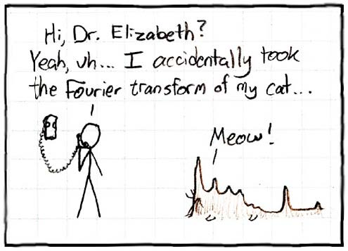
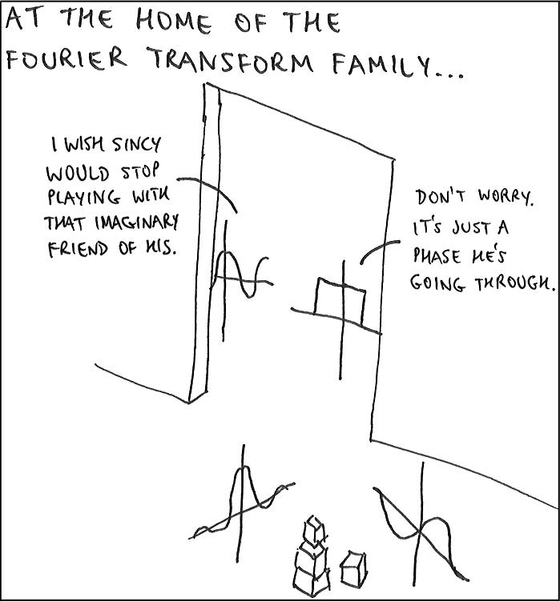

---
# You don't need to edit this file, it's empty on purpose.
# Edit theme's home layout instead if you wanna make some changes
# See: https://jekyllrb.com/docs/themes/#overriding-theme-defaults
layout: default
---

<h2>Spring 2018</h2>

### Modules
{: .modules}

* __Module 0:__ Review.
* __Module 1:__ Sampling and Reconstruction
  - 
  -
 
  
### Cartoons
{: .cartoons}
How do you know this guy is insane?  

Spectrum *not* symmetric, so cat must be imaginary.

 

 
